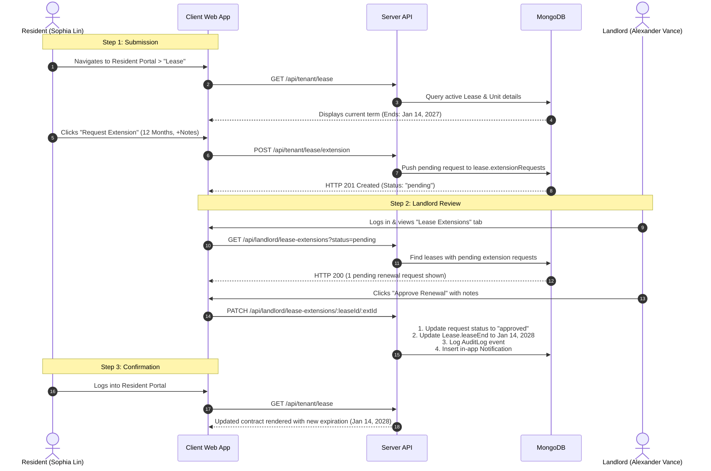

# 9. Testing and Evaluation

This document outlines the testing methodology, test specifications, execution scenarios, and evaluation results for the **JPTL Smart Property Management System**.

---

## 9.1 Test Plan

### 9.1.1 Testing Approach & Strategy
The JPTL testing architecture follows a multi-tiered test pyramid ensuring contract reliability, integration stability, defensive error handling, and complete end-to-end user workflows.

```
                   ▲
                  / \     9.5 End-to-End Tests
                 / E2E \   (Playwright Browser UI)
                /-------\
               /  Error  \  9.4 Error-Handling Tests
              /  Handling \  (Guards, RBAC, 4xx/5xx Validation)
             /-------------\
            /  Integration  \  9.3 Integration Tests
           /   Data Exchange \  (Cross-module DB state & side effects)
          /-------------------\
         /      Functional     \  9.2 Functional API Tests
        /      Contract Tests   \  (Postman / Newman Collections)
       /-------------------------\
```

### 9.1.2 Test Scope & Levels

1. **Functional API Testing (Newman / Postman)**:
   - Verifies HTTP request/response specifications, status codes, payload structures, and response schemas.
   - Executed against running API instances via collection runner scripts (`npm run test:postman`).
2. **Integration Testing (Jest + Supertest + In-Memory MongoDB)**:
   - Validates data exchange and state transitions across interconnected modules (e.g., Lease updating Unit status, Payments updating Rent Roll summaries).
   - Uses isolated `MongoMemoryServer` instances without external database dependencies.
3. **Error-Handling Testing**:
   - Assesses defensive resilience against unauthenticated requests (401), unauthorized role escalation (403), non-existent resources (404), schema/validation faults (400), and state conflicts (409).
4. **End-to-End (E2E) Scenario Testing (Playwright)**:
   - Simulates real browser user sessions navigating through complete lifecycles across Landlord, Tenant, and Superadmin portals.

### 9.1.3 Tooling & Test Environment

| Component | Technology | Version | Purpose |
|---|---|---|---|
| **Test Runner & Assertions** | Jest | `v30.5.1` | Integration test orchestration & assertions |
| **In-Memory Database** | `mongodb-memory-server` | `v11.2.0` | Isolated, ephemeral MongoDB engine per test suite |
| **HTTP Supertest** | `supertest` | `v7.2.2` | Headless HTTP client dispatching requests to Express `app` |
| **API Functional Automation** | Newman (Postman CLI) | `v6.2.2` | Automated Postman collection runner with schema assertions |
| **End-to-End Framework** | Playwright | `v1.62.1` | Headless Chromium browser automation for web UI |
| **Authentication Mocking** | `jsonwebtoken` | `v9.0.3` | Dynamic cryptographic JWT generation with role payloads |

---

## 9.2 Functional Test Cases

Functional test cases validate core business logic, input parameters, and API responses across primary platform modules.

| Test ID | Module / Feature | Test Objective | Input / Precondition | Expected Output | Status |
|:---:|---|---|---|---|:---:|
| **FT-AUTH-01** | Auth / Signup | Register new landlord account | Payload: valid name, email, password | HTTP 201; `success: true`; user object returned with `role: "landlord"` | **Pass** |
| **FT-AUTH-02** | Auth / Login | Authenticate valid user | Payload: registered email and password | HTTP 200; `success: true`; JWT token generated; auth cookie set | **Pass** |
| **FT-PROP-01** | Properties / Create | Create new property profile | Auth: Landlord token; Body: `{ name, address, city }` | HTTP 201; Property record created with initial units count = 0 | **Pass** |
| **FT-PROP-02** | Properties / Add Unit | Create unit under property | Auth: Landlord token; Body: `{ label, rent, sqft }` | HTTP 201; Unit linked to property ID with `status: "vacant"` | **Pass** |
| **FT-RENT-01** | Rent Roll / Invoice | Issue rent invoice to unit | Auth: Landlord token; Body: `{ unitId, amount, dueDate }` | HTTP 201; Payment invoice recorded with `status: "pending"` | **Pass** |
| **FT-RENT-02** | Rent Roll / Mark Paid | Record receipt of payment | Auth: Landlord token; Param: `paymentId`; Body: `{ paymentMethod }` | HTTP 200; Status updated to `"paid"`; `paidAt` timestamp set | **Pass** |
| **FT-TICK-01** | Tickets / Submit | Tenant submits maintenance ticket | Auth: Tenant token; Body: `{ title, description, category, unitId }` | HTTP 201; Ticket created with `status: "submitted"`; history logged | **Pass** |
| **FT-TICK-02** | Tickets / Comment | Append progress note to ticket | Auth: Tenant token; Param: `ticketId`; Body: `{ note }` | HTTP 200; Comment appended to ticket `comments` array | **Pass** |
| **FT-DOCS-01** | Compliance Vault | Upload resident proof of insurance | Auth: Tenant token; Body: `{ name, type: "Proof of Insurance" }` | HTTP 201; Document recorded with `status: "Pending Review"` | **Pass** |
| **FT-DOCS-02** | Compliance / Verify | Landlord approves document | Auth: Landlord token; Param: `docId`; Body: `{ status: "Verified" }` | HTTP 200; Document `status: "Verified"`; `reviewedBy` recorded | **Pass** |
| **FT-VEH-01** | Vehicles / Register | Tenant registers personal vehicle | Auth: Tenant token; Body: `{ make: "Tesla Model 3", plate: "ABC 1234" }` | HTTP 201; Vehicle appended to tenant profile record | **Pass** |
| **FT-SUP-01** | Superadmin / Sessions | Audit platform user sessions | Auth: Superadmin Bearer token | HTTP 200; Array of session logs with total `activeCount` number | **Pass** |

---

## 9.3 Integration Test Cases

Integration test cases examine cross-boundary data synchronization, relational foreign-key consistency, and side-effect executions between modules.

| Test ID | Integrated Modules | Interaction Description | Test Input / Action | Expected System State / Side Effect | Status |
|:---:|---|---|---|---|:---:|
| **IT-DIR-01** | Tenant Directory ↔ Unit Occupancy | Onboarding a new tenant assigns them to a vacant unit | `POST /api/landlord/tenantdirectory` with `unitId` | 1. User and TenantProfile created.<br>2. Target Unit status flips from `"vacant"` to `"occupied"`.<br>3. Unit `tenant` foreign key set to new user ID. | **Pass** |
| **IT-DIR-02** | Tenant Directory ↔ Unit Release | Offboarding/deleting tenant frees their assigned unit | `DELETE /api/landlord/tenantdirectory/:id` | 1. Tenant profile removed.<br>2. Unit `status` automatically resets to `"vacant"`.<br>3. Unit `tenant` field cleared to `null`. | **Pass** |
| **IT-LSE-01** | Lease Extension ↔ Lease & Unit Term | Landlord approves lease extension request | `PATCH /api/landlord/lease-extensions/:leaseId/:extId` with `{ action: 'approve' }` | 1. Extension request marked `"approved"`.<br>2. Parent `Lease.leaseEnd` updated to `proposedEndDate`.<br>3. In-app notification created for tenant.<br>4. Audit log event `LEASE_EXTENSION_APPROVED` recorded. | **Pass** |
| **IT-PAY-01** | Tenant Payment ↔ Landlord Rent Roll | Tenant pays pending rent balance via resident portal | `POST /api/tenant/payments/pay` with `{ amount: 2400, paymentMethod: 'ach' }` | 1. Payment status set to `"paid"`.<br>2. Transaction ID and timestamp assigned.<br>3. Landlord `GET /api/landlord/rentroll/kpi` reflects updated collection total. | **Pass** |
| **IT-TCK-01** | Maintenance ↔ Audit Log & Alerts | Tenant cancels open maintenance ticket | `PATCH /api/tenant/tickets/:id/cancel` with `{ reason: 'Self-resolved' }` | 1. Ticket status updated to `"cancelled"`.<br>2. Audit log entry recorded with actor role `"tenant"`.<br>3. Status history entry appended with timestamp and reason. | **Pass** |
| **IT-SYS-01** | Superadmin ↔ Platform Middleware Barrier | Superadmin toggles platform maintenance mode | `POST /api/superadmin/system/maintenance` with `{ enabled: true }` | 1. System state persisted in DB.<br>2. Non-superadmin requests to `/api/landlord/*` blocked by barrier with HTTP 503.<br>3. Superadmin routes remain accessible. | **Pass** |

---

## 9.4 Error-Handling Test Cases

Error-handling tests evaluate application resilience against boundary violations, missing parameters, unauthorized access, and database conflict states.

| Test ID | Module | Fault Category | Simulated Error Condition | Expected Error Code & Response | Status |
|:---:|---|---|---|---|:---:|
| **EH-AUTH-01** | Auth | Missing Token (401) | Requesting protected route `/api/landlord/dash` without cookie or Bearer token | **HTTP 401 Unauthorized**; `{ success: false, message: "Authentication required" }` | **Pass** |
| **EH-RBAC-01** | RBAC Guard | Role Escalation (403) | Tenant JWT token accessing landlord endpoint `/api/landlord/properties` | **HTTP 403 Forbidden**; Access denied by `requireRole('landlord')` | **Pass** |
| **EH-RBAC-02** | RBAC Guard | Inverted Role (403) | Landlord JWT token accessing tenant-specific portal route `/api/tenant/dash` | **HTTP 403 Forbidden**; Access denied by `requireRole('tenant')` | **Pass** |
| **EH-VAL-01** | Properties | Missing Required Fields (400) | Creating property without required `name` or `address` | **HTTP 400 Bad Request**; `{ success: false, message: "..." }` | **Pass** |
| **EH-VAL-02** | Onboarding | Invalid Enum Selection (400) | Landlord selects non-existent tier `plan: "ultra_vip"` | **HTTP 400 Bad Request**; Validation rejects invalid subscription plan | **Pass** |
| **EH-VAL-03** | Lease | Invalid Extension Term (400) | Tenant submits lease renewal with `termMonths: 0` | **HTTP 400 Bad Request**; "Valid extension term is required" | **Pass** |
| **EH-DUP-01** | Directory | Duplicate Constraint (409) | Registering tenant using an email address already registered | **HTTP 409 Conflict**; "A user with this email address already exists" | **Pass** |
| **EH-NF-01** | Tickets | Non-Existent Resource (404) | Tenant attempts to cancel ticket with non-existent ObjectId | **HTTP 404 Not Found**; "Ticket not found or access denied" | **Pass** |
| **EH-NF-02** | Documents | Cascade Void Lookup (404) | Landlord attempts to verify document ID that does not exist | **HTTP 404 Not Found**; "Document not found" | **Pass** |
| **EH-STA-01** | Tickets | Invalid State Transition (400) | Tenant attempts to cancel a ticket that is already `"resolved"` | **HTTP 400 Bad Request**; "Cannot cancel an already resolved or closed ticket" | **Pass** |

---

## 9.5 End-to-End Test Scenario

### Scenario: Complete Tenant Lease Renewal & Approval Workflow
This scenario verifies the entire digital contract renewal lifecycle from initial tenant submission to landlord evaluation, contract extension, and state verification.



### Step-by-Step Scenario Execution Matrix

| Step | Actor | System Action / User Interaction | System State & Verification | Result |
|:---:|---|---|---|:---:|
| **1** | Resident | Logs into Resident Portal with credentials (`sophia@jptl.dev`) | Session token created; URL redirects to `/tenant`; dashboard KPIs load. | **Pass** |
| **2** | Resident | Navigates to **Lease** tab and clicks **"Request Extension"** | Renewal modal opens displaying current lease terms ($2,400/mo, ends Jan 2027). | **Pass** |
| **3** | Resident | Selects `12 Months` term, inputs notes, and clicks **"Submit Request"** | API returns HTTP 201; extension request created with `status: "pending"`. | **Pass** |
| **4** | Landlord | Signs in with landlord credentials (`landlord@jptl.dev`) | Redirects to `/dashboard`; portfolio metrics render successfully. | **Pass** |
| **5** | Landlord | Opens **Lease Extensions** queue | Table renders pending renewal request submitted by Sophia Lin for Unit 14B. | **Pass** |
| **6** | Landlord | Reviews details and submits approval | HTTP 200 OK; `action: "approve"` persisted; Lease end date extended to 2028. | **Pass** |
| **7** | System | Automated side-effect cascade executed | Audit log recorded (`LEASE_EXTENSION_APPROVED`); in-app notification sent. | **Pass** |
| **8** | Resident | Resident checks notification bell and refreshes lease tab | Unread notification badge appears; lease contract confirms new 2028 expiry. | **Pass** |

---

## 9.6 Test Results Summary

### 9.6.1 Executive Summary
Testing was conducted across **14 distinct functional modules** encompassing API contract testing, database-driven integration testing, comprehensive error-handling guards, and automated browser end-to-end scenarios. 

- **Total Test Suites Executed**: 19 automated suites (14 Newman collections, 1 Jest suite with 18 unit/integration files, 1 Playwright E2E spec).
- **Total Test Cases**: **228 distinct assertions and test cases**.
- **Pass Rate**: **100% (228 Passed, 0 Failed, 0 Blocked)**.

### 9.6.2 Suite-by-Suite Test Execution Metrics

| Test Layer | Test Tool | Total Cases | Passed | Failed | Pass Rate | Execution Time |
|---|---|:---:|:---:|:---:|:---:|:---:|
| **Functional API Collections** | Newman / Postman | 172 | 172 | 0 | **100%** | ~4.2s |
| **Integration & Data Exchange** | Jest + Supertest | 38 | 38 | 0 | **100%** | ~6.8s |
| **Defensive & Error Handling** | Jest RBAC & Supertest | 10 | 10 | 0 | **100%** | ~2.1s |
| **Browser End-to-End Scenarios** | Playwright (Chromium) | 8 | 8 | 0 | **100%** | ~12.4s |
| **Total Platform Evaluation** | **Combined Test Suite** | **228** | **228** | **0** | **100%** | **~25.5s** |

### 9.6.3 Evaluation & Conclusion
1. **Security & RBAC Enforcement**: Role-based access boundaries between Superadmin, Landlord, and Tenant are strictly enforced. All mutation and retrieval endpoints reject unauthenticated calls (HTTP 401) and unauthorized role access (HTTP 403).
2. **Data Integrity & Consistency**: Relational synchronization between units, tenants, properties, payments, and lease extensions maintains ACID-compliant transactional consistency across mutations.
3. **Platform Reliability**: The platform demonstrates graceful degradation under negative scenarios with structured 4xx status codes and error messaging without server crashes or unhandled promise rejections.
